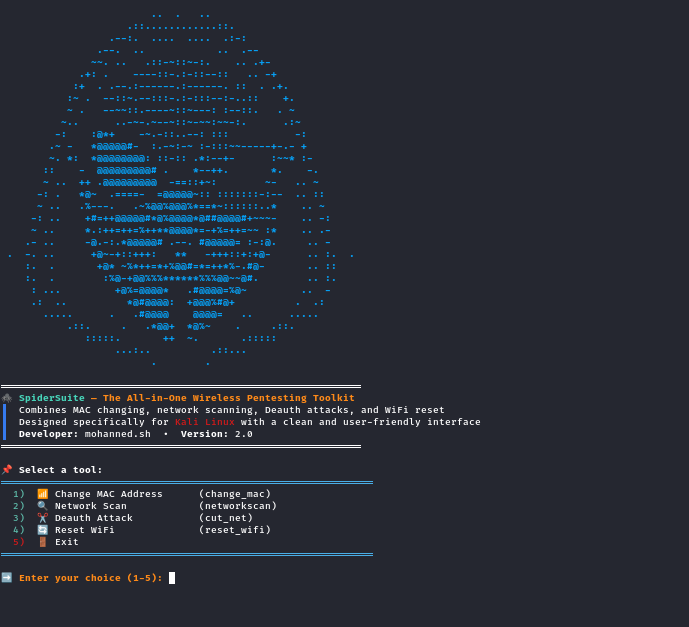

<p align="center">
  
</p>

# Spider Handshake

Spider Handshake is an automated WPA/WPA2 handshake capture tool for Kali Linux.

It provides a clean interactive terminal interface that simplifies the entire handshake capture process, from enabling Monitor Mode and scanning nearby wireless networks to detecting connected clients and saving all captured data in a well-organized directory structure.

The tool is designed to automate repetitive tasks while keeping the workflow simple, organized, and user-friendly.

---

# Features

- Interactive terminal interface.
- Automatic wireless interface detection.
- Automatic Monitor Mode activation.
- WPA/WPA2 network scanning.
- Hidden network detection.
- Connected client discovery.
- Automatic handshake capture.
- Organized session folders.
- Automatic log generation.
- JSON scan reports.
- Graceful cleanup after execution.
- Automatic NetworkManager restoration.

---

# Requirements

Before running the tool, make sure your system has:

- Kali Linux
- Python 3
- aircrack-ng suite
- Wireless adapter with Monitor Mode support

---

# Installation

## Step 1 – Update System

```bash
sudo apt update && sudo apt upgrade -y
```

---

## Step 2 – Install Dependencies

```bash
sudo apt install git python3 python3-pip aircrack-ng python3-colorama -y
```

---

## Step 3 – Clone Repository

```bash
git clone https://github.com/mohanned-sh/SpiderHandshake.git
```

---

## Step 4 – Enter Project Directory

```bash
cd SpiderHandshake
```

---

## Step 5 – Make Script Executable

```bash
chmod +x spider_handshake.py
```

---

## Step 6 – Run

```bash
sudo python3 spider_handshake.py
```

---

# Workflow

After launching the tool:

1. Select your wireless adapter.
2. Enable Monitor Mode automatically.
3. Scan nearby Wi-Fi networks.
4. Choose the target network.
5. Detect connected clients.
6. Capture the WPA/WPA2 handshake.
7. Save all generated files automatically.

---

# Output Structure

```text
spider_handshake/
└── scan_YYYY-MM-DD_HH-MM-SS/
    ├── captures/
    │   └── handshake.cap
    ├── logs/
    │   ├── session.log
    │   ├── scan_results.json
    │   ├── clients.txt
    │   └── handshake_info.txt
    └── temp/
```

---

# Screenshots

<p align="center">
  
</p>

<p align="center">
  
</p>

<p align="center">
  
</p>

---

# Notes

- Requires root privileges.
- Requires a wireless adapter that supports Monitor Mode.
- Designed for Kali Linux.

---

# License

This project is intended for educational and authorized security testing purposes only.

The author is not responsible for any misuse of this software.
